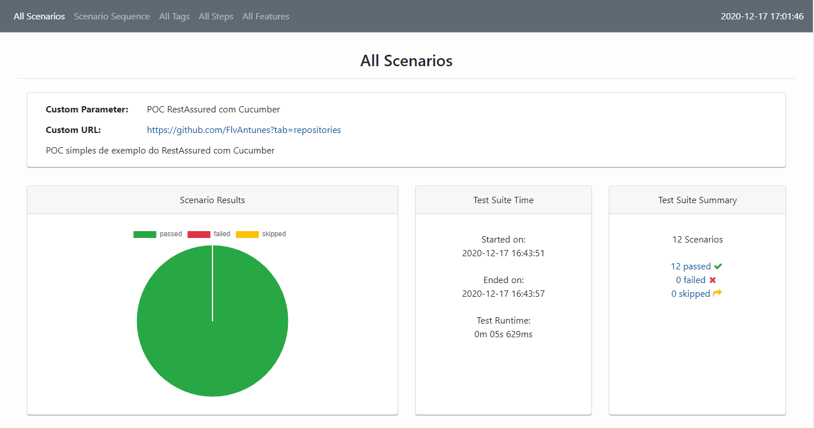

#
# Rest-assured com Cucumber

Este é um modelo simples de um projeto Maven para teste de API REST. Utilizei os frameworks Rest-Assured e o Cucumber para organizar os cenários de teste na linguagem Gherkin.

___
**Dependencias**

- [cucumber-java (io.cucumber) - V6.8.2](https://mvnrepository.com/artifact/io.cucumber/cucumber-java/6.8.2)
- [cucumber-junit (io.cucumber) - V6.8.2](https://mvnrepository.com/artifact/io.cucumber/cucumber-junit/6.8.2)
- [rest-assured (io.rest-assured) - V4.3.1](https://mvnrepository.com/artifact/io.rest-assured/rest-assured/4.3.1)

**Plugins**
- [cluecumber-report-plugin (com.trivago.rta) - v2.6.1](https://github.com/trivago/cluecumber-report-plugin)


___
# Getting Started

Antes de começar, verifique se você tem instalado em sua máquina a versão do **Maven** >= 3.6.3, e a versão do **Java** >= 11.

```console
mvn -version
java -version
```
___
**Instalação e 1º execução**

Instale as dependências e rode o primeiro teste executando o comando abaixo na raiz do projeto.

```console
mvn install
```

Após a execução dos testes, um relatório em HTML é gerado na pasta `target\generated-report`. Dentro desta pasta abra o arquivo `index.html` para visualizar o relatório no seu browser e acessar todos os detalhes da execução.
#




O relatório utilizado foi o [Cluecumber Report Plugin](https://github.com/trivago/cluecumber-report-plugin), para mais configurações acesse a documentação no [link](https://github.com/trivago/cluecumber-report-plugin).

___

**Execução dos Testes**

Apos a instalação das dependências e a execução do primeiro teste, voce pode executar somente os teste utilizando o comando abaixo na raiz do projeto:

```console
mvn test
```

Após essa execução, o relatório de teste não será atualizado automaticamente. Para atualizar o relatório execute o comando abaixo

```console
mvn cluecumber-report:reporting
```
___
#Referências


- [Rest-assured](https://rest-assured.io/)
- [Cucumber](https://cucumber.io/)
- [Cluecumber Report](https://tech.trivago.com/2017/11/16/cluecumber-report-maven-plugin-for-cucumber-test-reporting/)